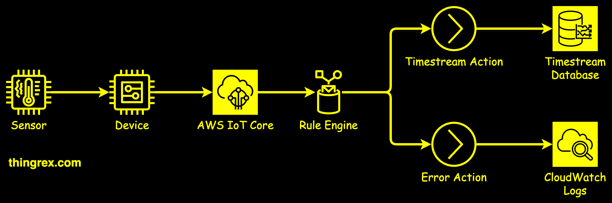

# Overview

This is the final end-to-end solution overview:



[Amazon Timestream](https://docs.aws.amazon.com/timestream/latest/developerguide/what-is-timestream.html) is a purpose-built time-series database offered by AWS.

[Time series data](https://en.wikipedia.org/wiki/Time_series) is a sequence of data points recorded over time. It is used to track events that change over time, such as sensor readings from connected IoT devices.

Let's start by deploying our lab environment using [AWS CDK](https://docs.aws.amazon.com/cdk/v2/guide/home.html) and [Python](https://www.python.org/) code.

*Note:* This repository is currently a work in progress, including the scope presented in my [YouTube playlist](https://www.youtube.com/playlist?list=PL6twZ0y9DipheeEO0d2rTOHyohw3lKIdu).

## Quick start

```bash
python3 -m venv venv
source venv/bin/activate
pip install -U pip
pip install -U -r requirements.txt
cdk --profile default deploy --all
```

Examine results via the [AWS Web Console](https://aws.amazon.com/console/).

Remove cloud resources once you finish working with this lab to avoid AWS costs.

```bash
cdk --profile default destroy --all
```

## Explanation

In the [first step](https://github.com/LMtx/Amazon_Timestream_AWS_IoT_Core_Lab/tree/001_timestream_db), we deployed the Amazon Timestream Database.

Before AWS IoT Core can send telemetry data to that database, we need to grant it permission to do so. Please remember that AWS services can not interact with each other without explicit authorization.

We will [create an IAM Role](https://github.com/LMtx/Amazon_Timestream_AWS_IoT_Core_Lab/tree/002_iam_role) allowing AWS IoT Core to execute actions defined in an IAM Policy.


Codifying IAM Roles and Policies provides several benefits:<br />
✅ Tracking permission changes ("who" changed "what" on what "date").<br />
✅ Auditing security posture (analyzing code to detect potential issues).<br />
✅ Deploying the same set of privileges to Dev/Test/Int/Prod environments.

## Useful links

### AWS CLI

https://docs.aws.amazon.com/cli/latest/userguide/cli-chap-getting-started.html
